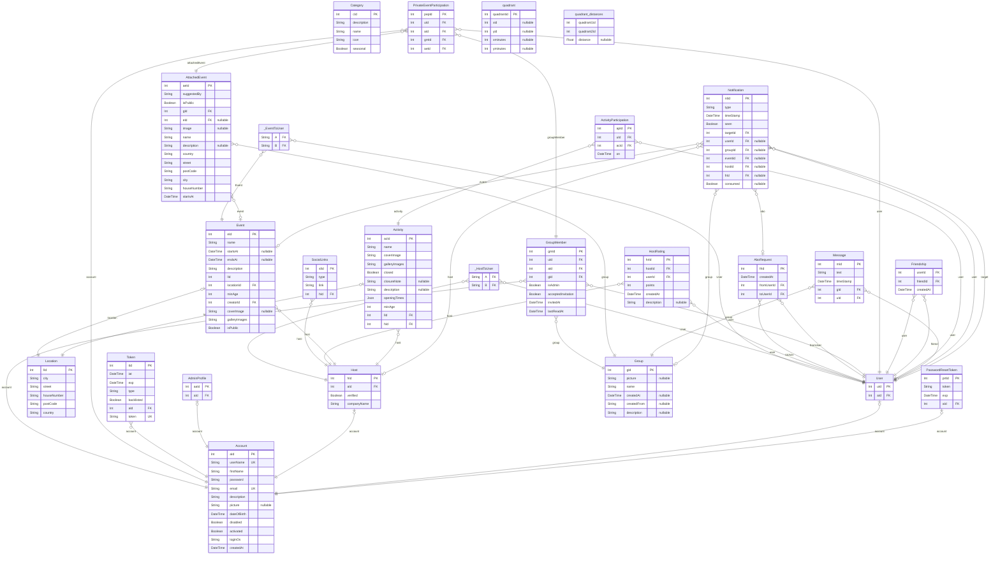

# Shopping Mall
> Generated by [`prisma-markdown`](https://github.com/samchon/prisma-markdown)

- [default](#default)

## default

### `PasswordResetToken`

**Properties**
  - `prtId`: 
  - `token`: 
  - `exp`: 
  - `aId`: 

### `Notification`

**Properties**
  - `ntId`: 
  - `type`: 
  - `timeStamp`: 
  - `seen`: 
  - `targetId`: 
  - `userId`: 
  - `groupId`: 
  - `eventId`: 
  - `hostId`: 
  - `frId`: 
  - `consumed`: 

### `Location`

**Properties**
  - `lId`: 
  - `city`: 
  - `street`: 
  - `houseNumber`: 
  - `postCode`: 
  - `country`: 

### `User`

**Properties**
  - `uId`: 
  - `aId`: 

### `Host`

**Properties**
  - `hId`: 
  - `aId`: 
  - `verified`: 
  - `companyName`: 

### `Account`

**Properties**
  - `aId`: 
  - `userName`: 
  - `firstName`: 
  - `password`: 
  - `email`: 
  - `description`: 
  - `picture`: 
  - `dateOfBirth`: 
  - `disabled`: 
  - `activated`: 
  - `loginOs`: 
  - `createdAt`: 

### `Message`

**Properties**
  - `mId`: 
  - `text`: 
  - `timeStamp`: 
  - `gId`: 
  - `uId`: 

### `Activity`

**Properties**
  - `acId`: 
  - `name`: 
  - `coverImage`: 
  - `galleryImages`: 
  - `closed`: 
  - `closureNote`: 
  - `description`: 
  - `openingTimes`: 
  - `minAge`: 
  - `lId`: 
  - `hId`: 

### `ActivityParticipation`

**Properties**
  - `apId`: 
  - `uId`: 
  - `acId`: 
  - `on`: 

### `AdminProfile`

**Properties**
  - `aaId`: 
  - `aId`: 

### `Category`

**Properties**
  - `cId`: 
  - `description`: 
  - `name`: 
  - `icon`: 
  - `seasonal`: 

### `Event`

**Properties**
  - `eId`: 
  - `name`: 
  - `startsAt`: 
  - `endsAt`: 
  - `description`: 
  - `lId`: 
  - `locationId`: 
  - `minAge`: 
  - `creatorId`: 
  - `coverImage`: 
  - `galleryImages`: 
  - `isPublic`: 

### `Friendship`

**Properties**
  - `userId`: 
  - `friendId`: 
  - `createdAt`: 

### `Token`

**Properties**
  - `tId`: 
  - `iat`: 
  - `exp`: 
  - `type`: 
  - `backlisted`: 
  - `aId`: 
  - `token`: 

### `Group`

**Properties**
  - `gId`: 
  - `picture`: 
  - `name`: 
  - `createdAt`: 
  - `createdFrom`: 
  - `description`: 

### `AttachedEvent`

**Properties**
  - `aeId`: 
  - `suggestedBy`: 
  - `isPublic`: 
  - `gId`: 
  - `eId`: 
  - `image`: 
  - `name`: 
  - `description`: 
  - `country`: 
  - `street`: 
  - `postCode`: 
  - `city`: 
  - `houseNumber`: 
  - `startsAt`: 

### `PrivateEventParticipation`

**Properties**
  - `pepId`: 
  - `uId`: 
  - `aId`: 
  - `gmId`: 
  - `aeId`: 

### `GroupMember`

**Properties**
  - `gmId`: 
  - `uId`: 
  - `aId`: 
  - `gId`: 
  - `isAdmin`: 
  - `acceptedInvitation`: 
  - `invitedAt`: 
  - `lastReadAt`: 

### `AboRequest`

**Properties**
  - `frId`: 
  - `createdAt`: 
  - `fromUserId`: 
  - `toUserId`: 

### `HostRating`

**Properties**
  - `hrId`: 
  - `hostId`: 
  - `userId`: 
  - `points`: 
  - `createdAt`: 
  - `description`: 

### `SocialLinks`

**Properties**
  - `slId`: 
  - `type`: 
  - `link`: 
  - `hId`: 

### `quadrant`

**Properties**
  - `quadrantid`: 
  - `xid`: 
  - `yid`: 
  - `xminutes`: 
  - `yminutes`: 

### `quadrant_distances`

**Properties**
  - `quadrant1id`: 
  - `quadrant2id`: 
  - `distance`: 

### `_HostToUser`
Pair relationship table between [Host](#Host) and [User](#User)

**Properties**
  - `A`: 
  - `B`: 

### `_EventToUser`
Pair relationship table between [Event](#Event) and [User](#User)

**Properties**
  - `A`: 
  - `B`: 